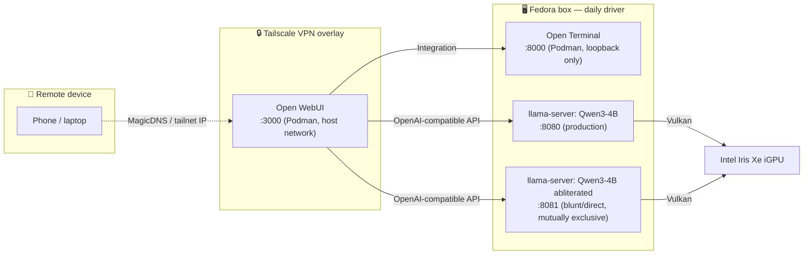

<div align="center">

# 🧠 LocalAI

**Dual-OS (Windows + Fedora) local LLM serving, built around `llama.cpp` — no discrete GPU, just an Intel iGPU and Vulkan.**

[](docs/hardware.md)
[](docs/hardware.md)
[](llama.cpp)
[](docs/hardware.md)
[](#quick-start)
[](#quick-start)
[](#quick-start)
[](JOURNAL.md)
[](LICENSE)

</div>

---

## Overview

No discrete GPU, no cloud API, no subscription — a 16GB laptop with an Intel iGPU serving multiple local models through llama.cpp's Vulkan backend, fronted by a real chat UI, reachable from a phone over Tailscale. Started on Windows, ported to Fedora as the daily driver.

This repo is both a working setup and its own documentation: every bug, workaround, and dead end along the way is logged in [`JOURNAL.md`](JOURNAL.md), and the polished, structured version of that history lives in [`docs/`](docs/).

## Features

- **Zero cloud dependency** — every model runs locally on integrated graphics, nothing leaves the machine.
- **Vulkan iGPU offload** — full-layer GPU offload on an Intel Iris Xe iGPU, no discrete card required.
- **Dual-model chat** — a production agent-mode model and a separate blunt/uncensored model, both registered in Open WebUI, run mutually exclusively without reconfiguration.
- **Agent tooling** — real tool-calling (Builtin Tools) and a shell/file Integration (Open Terminal), verified end-to-end through Open WebUI, not just curl.
- **Remote access** — reachable from a phone over a Tailscale VPN overlay, no port-forwarding or public exposure.
- **Documented crash hardening** — local patches and mitigations for a real iGPU fence-timeout bug, turning silent crashes into clean, recoverable errors.

## Architecture



Full component breakdown and design rationale: [`docs/architecture.md`](docs/architecture.md). Hardware specs: [`docs/hardware.md`](docs/hardware.md).

## Quick Start

```bash
# Fedora — start the production chat model
./start-qwen3.sh

# ...or the blunt/uncensored variant (mutually exclusive with the above)
./start-qwen3-uncensored.sh

# Chat frontend (Podman, idempotent — creates once, starts thereafter)
./start-open-webui.sh          # → http://localhost:3000

# Shell/file access for the models, wired in as an Open WebUI Integration
./start-open-terminal.sh       # → http://localhost:8000
```

Models aren't checked into this repo (multi-GB GGUF files). Building `llama.cpp` from source, placing model weights, Tailscale setup, and every flag's reasoning are in [`SETUP.md`](SETUP.md) — start there for anything beyond running an already-built setup.

## Repository Structure

```
LocalAI/
├── llama.cpp/                    # upstream checkout, built from source (Vulkan) — gitignored, see docs/hardware.md
├── models/                       # GGUF weights — gitignored, multi-GB binaries, see docs/hardware.md
├── start-qwen3.sh                # production chat/coding/agent model
├── start-qwen3-uncensored.sh     # abliterated blunt/direct-assistant variant
├── start-gemma-e4b.sh            # vision chat (deprioritized)
├── start-open-webui.sh           # Open WebUI, rootless Podman
├── start-open-terminal.sh        # shell/file API for the models, rootless Podman
├── docs/                         # topic-specific reference docs (see Documentation below)
├── screenshots/                  # UI screenshots (placeholders until captured)
├── SETUP.md                      # hardware, flags, models, full technical reference
├── JOURNAL.md                    # dated log of every change, fix, and incident
├── AGENTS.md                     # conventions for AI coding agents working in this repo
└── linkedin-post.md              # write-up of the Windows → Linux port
```

`llama.cpp/` and `models/` exist locally once [`SETUP.md`](SETUP.md)'s steps are followed, but aren't checked into Git — see [`docs/hardware.md`](docs/hardware.md#why-models-and-llamacpp-arent-in-git) for why.

## Screenshots

Not yet captured — placeholders and capture checklist in [`screenshots/`](screenshots/):

- Open WebUI homepage
- Model selection
- Chat interface
- Mobile access through Tailscale
- Terminal integration

## Benchmarks

| Model | Quant | Context | Speed | RAM | GPU Memory | Notes |
|-------|-------|---------|-------|-----|------------|-------|
| Qwen3-4B-Instruct-2507 | Q4_K_XL | 24576 | ~9–9.8 tok/s | ~530MB RSS | ~6GB | Production, port 8080 |
| Qwen3-4B-Instruct-2507-heretic-av2 | Q4_K_M | 24576 | ~9–11.6 tok/s | TODO | ~6GB | Blunt/direct, port 8081 |
| Gemma 4 E4B-it + mmproj | Q4_K_XL | 8192 | ~9–9.8 tok/s | TODO | TODO | Deprioritized fallback |

Full numbers, multi-turn cache-reuse data, and agent-mode round-trip timings: [`docs/benchmarks.md`](docs/benchmarks.md).

## Documentation

| File | What's in it |
|---|---|
| [`SETUP.md`](SETUP.md) | Hardware, directory layout, per-model flags, every issue hit and how it was resolved |
| [`docs/architecture.md`](docs/architecture.md) | Component breakdown and design rationale |
| [`docs/hardware.md`](docs/hardware.md) | Machine specs, Windows vs. Fedora, why `models/`/`llama.cpp/` aren't in Git |
| [`docs/models.md`](docs/models.md) | Every model tested, compared side by side |
| [`docs/benchmarks.md`](docs/benchmarks.md) | Full performance numbers |
| [`docs/troubleshooting.md`](docs/troubleshooting.md) | Structured Problem/Cause/Solution/Verification writeups |
| [`docs/lessons-learned.md`](docs/lessons-learned.md) | Practical conclusions from real experimentation |
| [`JOURNAL.md`](JOURNAL.md) | Dated running log — newest entries first |
| [`AGENTS.md`](AGENTS.md) | Conventions for AI coding agents working in this repo |
| [`llama.cpp/AGENTS.md`](llama.cpp/AGENTS.md) | Upstream contribution rules (only relevant inside `llama.cpp/`) |
| [`linkedin-post.md`](linkedin-post.md) | Narrative write-up of the Windows → Linux port |
| [`CONTRIBUTING.md`](CONTRIBUTING.md) | How to propose changes to this repo |
| [`SECURITY.md`](SECURITY.md) | Reporting a security issue, and documented network-exposure trade-offs |

## Roadmap

Framed as independent "chapters," each worth going deep on rather than a backlog to clear in order — full detail in [`SETUP.md`](SETUP.md#path-forward):

- [ ] Close the hallucination gap with real RAG (document/web-search grounding)
- [ ] Port the Windows-only MCP tool stack (filesystem/git/memory/fetch/shell) to Fedora
- [ ] Resolve the iGPU fence-timeout bug upstream, not just mitigate it
- [ ] Proper concurrent serving instead of manual model swapping
- [ ] Voice via `whisper.cpp`, routed around Gemma's dead-end audio path
- [ ] A small personal LoRA fine-tune
- [ ] Turn crash monitoring into real self-healing infrastructure
- [ ] A repeatable, scripted model-evaluation pipeline

---

<div align="center">
<sub>Built and maintained by <a href="https://github.com/onkarbadve">onkar</a> — a one-person, one-laptop local inference lab.</sub>
</div>
