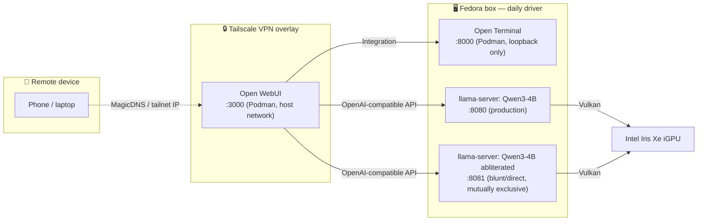

<div align="center">

# 🧠 LocalAI

**Dual-OS (Windows + Fedora) local LLM serving, built around `llama.cpp` — no discrete GPU, just an Intel iGPU and Vulkan.**

[](#hardware--os)
[](#hardware--os)
[](llama.cpp)
[](#hardware--os)
[](#quick-start)
[](#quick-start)
[](#quick-start)
[](JOURNAL.md)

</div>

---

No discrete GPU, no cloud API, no subscription — a 16GB laptop with an Intel iGPU serving multiple local models through llama.cpp's Vulkan backend, fronted by a real chat UI, reachable from a phone over Tailscale. Started on Windows, ported to Fedora as the daily driver. Every bug, workaround, and dead end along the way is logged in [`JOURNAL.md`](JOURNAL.md).

## Contents

- [Architecture](#architecture)
- [Hardware / OS](#hardware--os)
- [Models in production](#models-in-production)
- [Quick start](#quick-start)
- [Repo layout](#repo-layout)
- [Notable engineering](#notable-engineering)
- [Roadmap](#roadmap)
- [Documentation](#documentation)

## Architecture



Two `llama-server` processes register with Open WebUI at once (ports `8080`/`8081`) but run mutually exclusively — whichever one is live just shows up in the model picker, no reconfiguring needed. `open-terminal` stays `127.0.0.1`-only even over Tailscale, deliberately trading away a UI convenience for zero new network exposure on a shell-execution service.

## Hardware / OS

| | |
|---|---|
| **CPU** | Intel i5-12500H (4P+8E cores, 16 threads) |
| **GPU** | Intel Iris Xe iGPU — no discrete card, Vulkan-accelerated |
| **RAM** | 16GB system (~7.4–9.8GB Vulkan-visible budget) |
| **Daily driver** | Fedora 44 (`~/LocalAI`) |
| **Origin OS** | Windows (`C:\LocalAI`, preserved for reference) |
| **Inference engine** | [`llama.cpp`](llama.cpp), Vulkan backend, built from source |

## Models in production

| Model | Quant | Role | Speed (iGPU) | Port |
|---|---|---|---|---|
| Qwen3-4B-Instruct-2507 | Unsloth Dynamic Q4_K_XL | Chat / coding / agent-mode | ~9–9.8 tok/s | `8080` |
| Qwen3-4B-Instruct-2507-heretic-av2 (abliterated) | mradermacher Q4_K_M | Blunt/direct assistant, sensitive-but-legal topics | ~9–11.6 tok/s | `8081` |
| Gemma 4 E4B-it + mmproj | Unsloth Dynamic Q4_K_XL | Vision chat — deprioritized, kept as fallback | ~9–9.8 tok/s | `8080` |
| Qwen2.5-Coder-1.5B *(Windows only)* | Q4_K_M | Autocomplete | — | `8081` |

Full flag-by-flag config for every model lives in [`SETUP.md`](SETUP.md#per-script-configuration).

## Quick start

```bash
# Fedora — start the production chat model
./start-qwen3.sh

# ...or the blunt/uncensored variant (mutually exclusive with the above)
./start-qwen3-uncensored.sh

# Chat frontend (Podman, idempotent — creates once, starts thereafter)
./start-open-webui.sh          # → http://localhost:3000

# Shell/file access for the models, wired in as an Open WebUI Integration
./start-open-terminal.sh       # → http://localhost:8000
```

Models aren't checked into this repo (multi-GB GGUF files) — see [`SETUP.md`](SETUP.md#directory-layout) for what each script expects under `models/`.

## Repo layout

```
LocalAI/
├── llama.cpp/                    # upstream checkout, built from source (Vulkan)
├── models/                       # GGUF weights (gitignored — not checked in)
├── start-qwen3.sh                # production chat/coding/agent model
├── start-qwen3-uncensored.sh     # abliterated blunt/direct-assistant variant
├── start-gemma-e4b.sh            # vision chat (deprioritized)
├── start-open-webui.sh           # Open WebUI, rootless Podman
├── start-open-terminal.sh        # shell/file API for the models, rootless Podman
├── SETUP.md                      # hardware, flags, models, full technical reference
├── JOURNAL.md                    # dated log of every change, fix, and incident
└── linkedin-post.md              # write-up of the Windows → Linux port
```

## Notable engineering

A few of the sharper bugs chased down and documented in [`JOURNAL.md`](JOURNAL.md) / [`SETUP.md`](SETUP.md#issues-encountered-and-resolutions):

- **Silent generation corruption** — `llama-server` reported `/health: ok` while returning empty completions on every request; root-caused to GPU/Vulkan state left corrupted by an earlier fence-timeout, invisible from the outside until a full process restart.
- **`i915` iGPU fence-timeout / GPU hangs** — traced through kernel logs to a Vulkan compute submission issue on the integrated GPU; mitigated with `GGML_VK_MAX_NODES_PER_SUBMIT=1`, monitored live via a custom `systemd` watcher service that alerts on recurrence.
- **Two independent multi-turn caching bugs**, one per model family — Qwen3.5's hybrid SSM architecture stuck `cached_tokens` at a constant regardless of turn count (upstream, unresolved); Gemma silently reprocessed the entire conversation every turn until `--swa-full` was enabled.
- **Open WebUI's hidden dual terminal-connection stores** — chat-based tool calling and the Files/Terminal side panel resolve against two completely separate config stores, one of them admin-only with no linked UI page; traced through `open_webui`'s own source to find the real API path.
- **`--reasoning off` isn't a general fix** — worked around a Qwen3-specific template/checkpoint mismatch that caused runaway generation; verified *not* to apply to Gemma before reusing it, since blindly carrying it over would have silently dropped Gemma's `reasoning_content` separation.

## Roadmap

Framed as independent "chapters," each worth going deep on rather than a backlog to clear in order — full detail in [`SETUP.md`](SETUP.md#path-forward):

- [ ] Close the hallucination gap with real RAG (document/web-search grounding)
- [ ] Port the Windows-only MCP tool stack (filesystem/git/memory/fetch/shell) to Fedora
- [ ] Resolve the iGPU fence-timeout bug upstream, not just mitigate it
- [ ] Proper concurrent serving instead of manual model swapping
- [ ] Voice via `whisper.cpp`, routed around Gemma's dead-end audio path
- [ ] A small personal LoRA fine-tune
- [ ] Turn crash monitoring into real self-healing infrastructure
- [ ] A repeatable, scripted model-evaluation pipeline

## Documentation

| File | What's in it |
|---|---|
| [`SETUP.md`](SETUP.md) | Hardware, directory layout, per-model flags, every issue hit and how it was resolved |
| [`JOURNAL.md`](JOURNAL.md) | Dated running log — newest entries first |
| [`llama.cpp/AGENTS.md`](llama.cpp/AGENTS.md) | Upstream contribution rules (only relevant inside `llama.cpp/`) |
| [`linkedin-post.md`](linkedin-post.md) | Narrative write-up of the Windows → Linux port |

---

<div align="center">
<sub>Built and maintained by <a href="https://github.com/onkarbadve">onkar</a> — a one-person, one-laptop local inference lab.</sub>
</div>
