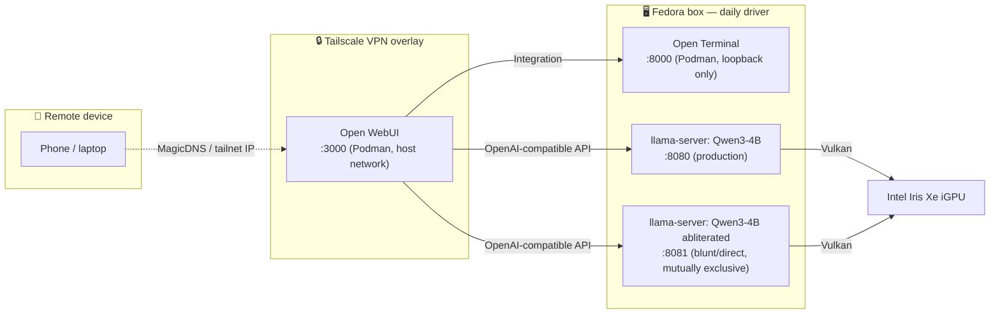

# Architecture

How the pieces on the Fedora daily driver talk to each other. For hardware specifics see [hardware.md](hardware.md); for exact launch flags see [SETUP.md](../SETUP.md).

## Components

- **`llama-server` (×2 registered, 1 running at a time)** — the inference engine, built from `llama.cpp` source with the Vulkan backend. Production (`start-qwen3.sh`, port `8080`) and an uncensored/blunt-mode variant (`start-qwen3-uncensored.sh`, port `8081`) both register as connections in Open WebUI, but only one process runs at once — combined Vulkan memory doesn't fit both simultaneously at their current context sizes (see [SETUP.md](../SETUP.md#qwen3-4b-instruct-2507-heretic-av2--uncensored-bluntdirect-assistant-start-qwen3-uncensoredsh-fedora-only)). Whichever port is live just shows up in Open WebUI's model picker.
- **Open WebUI (`:3000`)** — chat frontend, rootless Podman container, `--network host` so it can reach `llama-server`'s loopback-only ports without bridge-networking gymnastics.
- **Open Terminal (`:8000`)** — shell/file API wired into Open WebUI as a first-class Integration, giving chat models a place to actually execute commands. Deliberately bound `127.0.0.1`-only, even over Tailscale — see the Direct-vs-System note in [troubleshooting.md](troubleshooting.md#open-webui-terminal-integration-terminal-server-not-found).
- **Tailscale** — VPN overlay for remote access (phone, laptop away from home) without port-forwarding or public exposure. Open WebUI is reachable over the tailnet because `--network host` already binds it to `0.0.0.0:3000`; Open Terminal is deliberately *not* additionally exposed there.

## Design decisions worth calling out

- **Two chat models registered, one running**: rather than reconfigure Open WebUI's connection every time the active model changes, both `llama-server` ports are registered as connections up front (`OPENAI_API_BASE_URLS`, semicolon-separated). Switching models is just restarting the relevant `start-*.sh` script — Open WebUI reconnects automatically.
- **Open Terminal stays loopback-only**: a shell-execution service gets a more conservative default than the chat UI, which at least has a login page in front of it. This trades away the Files/Terminal side-panel view when accessing remotely (see [troubleshooting.md](troubleshooting.md)) in exchange for zero new network exposure.
- **Podman over Docker**: Fedora's default container engine, rootless by default, no persistent root daemon on a box that's also serving an LLM and reachable over Tailscale. See [JOURNAL.md](../JOURNAL.md) (2026-07-30 entry) for the full reasoning.

## Related documents

- [SETUP.md](../SETUP.md) — flag-by-flag configuration for every script
- [hardware.md](hardware.md) — the machine this runs on
- [troubleshooting.md](troubleshooting.md) — issues hit in this architecture and how they were resolved
- [JOURNAL.md](../JOURNAL.md) — dated log of how this architecture evolved
